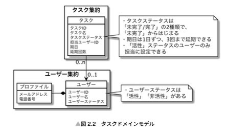

# DDDでアプリケーションを作ってみた（その1: タスク管理アプリケーション）

miro: https://miro.com/app/board/uXjVMv5Yxzg=/?share_link_id=97644384418

## はじめに
業務でDDDを採用してアプリケーションの開発をしています！  
→ が、先輩方がかなり大枠を作ってくれているので、実装する上ではなんとかできている（先輩方は偉大・・・）  
→ 一からモデリングしたわけでないので、まだ色々と理解があやふやなところがある   
→ モデリング〜実装〜テストコード実装まで一通りやってみる！

というわけで、実践DDDをしてみようという趣旨になっております。

以下、tatsutebさんの記事を参考にさせていただいてます！  
https://zenn.dev/tatsuteb/articles/f2d05abb8ce9a6

## 作成するシステムの仕様整理
今回作成するシステムは「TODOリスト」にしました。

TODOリストを題材にした理由
- シンプルな仕組みであること
- 複雑なドメインを扱うシステムをいきなりやると色々と挫折しそう・・・簡単なものをまずやろう

まずはシンプルなシステムをサクッと作ってみよう、ということで作成しました。

※ **今回の「TODO」リストは、 「タスク」とは明確に区別しており**、「しなければならない」「期日が決まっていないがやらないといけないこと、あるいはやることが望ましい仕事や作業」を管理するシステムという位置付けです。

### 実装スコープ
複数のフェーズで開発することにしました。本記事で紹介する内容は「**フェーズ1**」と捉えて、以下機能の実装をスコープとしています。
- TODOリストの登録ができる：タイトル＆TODO詳細（文字数制限は設ける！）
- TODOリストのデータを検索できる
- 選択したTODOリストの詳細の確認・完了・削除ができる
- ユーザーの登録：メールアドレスをIDとし、パスワードを設定する
- ユーザーの認証ができる

### デモ

## モデリング
- 今回、DDDを行う際に、モデリングの方法として「sudoモデリング」を参考にしました。  
https://little-hands.hatenablog.com/entry/2022/06/01/ddd-modeling

Sudoモデリングで提唱されている、以下の4つの図をまず作ることを進めました。

- 「sudoモデリング」
  - S：システム関連図
  - U：ユースケース図
  - D：ドメインモデル
  - O：オブジェクト図

### システム関連図
- 今回開発するシステムのシステム相関図を表しています。

### ユースケース図
- ユースケース図では、「ユーザの要求に対するシステムの振る舞いを定義」しています。
  - 〇〇をXXする　という形式で記述
  - フェーズごとのスコープがわかるように記述

### オブジェクト図
- ドメインモデル図を作成する前に、ドメインモデルの具体例を表す図をオブジェクト図として表現しました。
  - 実際にシステムで扱うデータの詳細をオブジェクト図にします。

### ドメインモデル
- 松岡さん著書：ドメイン駆動設計 モデリング/実装ガイドで図式化された以下の図を参考にドメインモデル図を作成しました。

参考: [ドメイン駆動設計 モデリング/実装ガイド](https://booth.pm/ja/items/18356321)
> 2.1.2 ドメインモデル図 図 2.2 タスクドメインモデル を引用

> ドメインモデル作成時のルール  
> 
> • オブジェクトの代表的な属性を書くが、メソッドまで書かなくてよい •「ルール/成約 (ドメイン知識)」を吹き出しに書き出す  
> • オブジェクト同士の関連を示す  
> • 多重度を定義する  
> • 集約の範囲を定義する  
> • 理解を促進するために、具体例などを書いても良い  

#### 補足

### 作成API一覧
- ユーザー登録API: `POST /users`
- ユーザー認証API: `POST /users/auth`
- TODOリスト登録API: `POST /todos`
- TODOリスト検索API: `GET /todos`
- TODOリスト詳細取得API: `GET /todos/{todoId}`
- TODOリスト完了API: `PUT /todos/{todoId}/complete`
- TODOリスト削除API: `DELETE /todos/{todoId}`
- TODOリスト詳細更新API: `PUT /todos/{todoId}`
