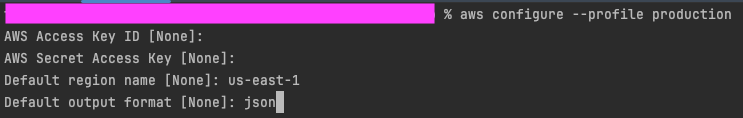

# 概要
- 仕事でAWSを使っているのだが、AWS CLIを使って複数のアカウントを切り替える方法でハマったのでメモ
- 以下のような状況を想定
  - AWS CLIを使って複数のアカウントを切り替えたい

# ユースケース
- AWS環境が以下のような構成になっている
  - 本番環境（production）
  - ステージング環境(staging)
  - 開発環境(development)
- それぞれの環境に対して、AWS CLIを使って操作したい
- AWS SSOアカウントが既に各環境に作成されている
  - AWS SSOアカウントには、それぞれの環境に対応したロールが作成されている
  - 例えば、本番環境に対応したロールは、`arn:aws:iam::123456789012:role/production-admin`のようなARNが割り当てられている
  - 詳しくは、[AWS SSOのドキュメント](https://docs.aws.amazon.com/ja_jp/singlesignon/latest/userguide/what-is.html)を参照

# それぞれの環境ごとのProfileを作成する
- `aws configure`というコマンドを使って、それぞれの環境ごとのProfileを作成する

```shell
$ aws configure --profile production
```
- 

- 作成すると、`~/.aws/credentials`に設定が保存される

```shell
$ cat ~/.aws/credentials

[default]
aws_access_key_id = AKIAxxxxxxxxxxxxxxx
aws_secret_access_key = xxxxxxxxxxxxxxxxxxxxxxxxxxxxxxxxxxxxxxxx
[production]
aws_access_key_id = AKIAxxxxxxxxxxxxxxx
aws_secret_access_key = xxxxxxxxxxxxxxxxxxxxxxxxxxxxxxxxxxxxxxxx
[staging]
aws_access_key_id = AKIAxxxxxxxxxxxxxxx
aws_secret_access_key = xxxxxxxxxxxxxxxxxxxxxxxxxxxxxxxxxxxxxxxx
[development]
aws_access_key_id = AKIAxxxxxxxxxxxxxxx
aws_secret_access_key = xxxxxxxxxxxxxxxxxxxxxxxxxxxxxxxxxxxxxxxx
```

# 複数のprofileを使用している場合にデフォルトで使用するprofileを変更する
- 以下コマンドを実行すると、デフォルトで使用するprofileを変更できる

```shell
$ export AWS_PROFILE=production -- ここではproductionをデフォルトにする
```

# profileを指定してコマンドを実行する
- 以下のように、`--profile`オプションを使って、profileを指定してコマンドを実行することも可能

```shell
$ aws s3 ls --profile production
```

# まとめ
- `aws configure`コマンドを使って、それぞれの環境ごとのProfileを作成する
- `export AWS_PROFILE=production`コマンドを使って、デフォルトで使用するprofileを変更する
- `--profile`オプションを使って、profileを指定してコマンドを実行することも可能
- もっとAWS CLIを勉強しないとダメですね・・・

# 参考
- [AWSのCLIを設定してみる](https://zenn.dev/mo_ri_regen/articles/aws-cli-setting)
- [AWS CLI を設定する環境変数](https://docs.aws.amazon.com/ja_jp/cli/latest/userguide/cli-configure-envvars.html)
