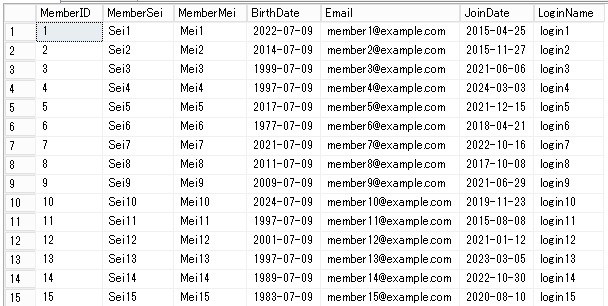
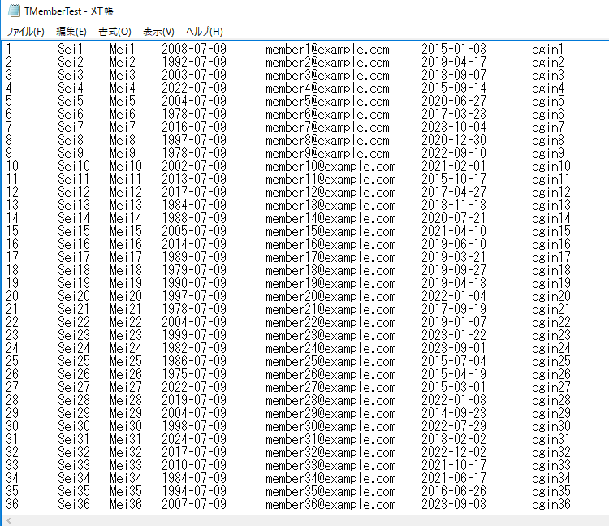
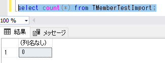
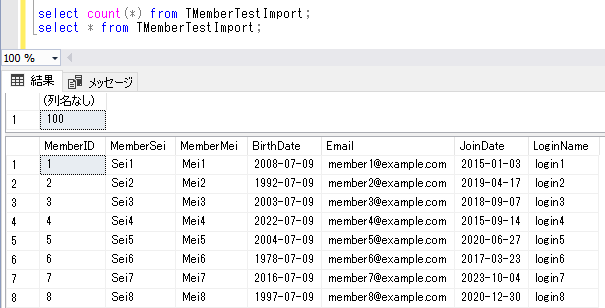

## SQLServerのBCPコマンドを使ってみる
- SQL Serverでbcpコマンドを使う機会があったのでメモ

### 参考
- [bcp ユーティリティ Microsoft公式](https://learn.microsoft.com/ja-jp/sql/tools/bcp-utility?view=sql-server-ver16&tabs=windows)
- [SQL Serverのbcpコマンドの使い方](https://mr-star.hatenablog.com/entry/sqlserver/020)
- [SQLServerに100万件データをブチ込むBCPコマンドについて](https://qiita.com/kannna5296/items/e59692e0f4a22c595b53)

## 概要
- bcpとは？
  - バルクコピー (`Bulk Copy Program`) は、SQL Server テーブルとファイル間でデータをコピーするためのコマンドラインユーティリティ
  - bcp ユーティリティを使うと、多数の新規行を SQL Server テーブルにインポートしたり、データをテーブルからデータ ファイルにエクスポートしたりできる
- SQL Serverのあるテーブルから大量のデータをエクスポートしたり、インポートしたりする際に使うと便利！
- bcopコマンドは、`SQL Serverのインストール時にインストールされる`ので、SQL Serverをインストールしていれば使える!

## 実際に使ってみよう
- SQL Serverがインストールされている環境で実際に使ってみます！

- SQL Serverがインストールされている環境でbcpユーティリティが使えることを確認
    - `bcp`コマンドを実行して、ヘルプが表示されればOK
```shell
bcp

使用法: bcp {dbtable | query} {in | out | queryout | format} datafile
  [-m 最大エラー数]        [-f フォーマット ファイル]   [-e エラー ファイル]
  [-F 先頭行]              [-L 最終行]                  [-b バッチ サイズ]
  [-n ネイティブ型]        [-c 文字型]                  [-w UNICODE 文字型]
  [-N text 以外のネイティブ型を保持] [-V ファイル フォーマットのバージョン] [-
引用符で囲まれた識別子]
  [-C コード ページ指定子] [-t フィールド ターミネータ] [-r 行ターミネータ]
  [-i 入力ファイル]        [-o 出力ファイル]            [-a パケット サイズ]
  [-S サーバー名]          [-U ユーザー名]              [-P パスワード]
  [-T 信頼関係接続]        [-v バージョン]              [-R 地域別設定有効]
  [-k NULL 値を保持]       [-E ID 値を保持]
  [-h "読み込みヒント"]    [-x XML フォーマット ファイルを生成]
  [-d database name]        [-K application intent]

bcp - v

BCP - Microsoft SQL Server の一括コピー プログラム。
Copyright (C) Microsoft Corporation. All Rights Reserved.
バージョン: 11.0.2100.60
```

bcpコマンドで使用するテーブルを以下クエリで作成しておく
```sql
DROP TABLE IF EXISTS TMemberTest;

CREATE TABLE TMemberTest
(
    MemberID  INT IDENTITY(1,1) CONSTRAINT PK_TMemberTest PRIMARY KEY CLUSTERED,
    MemberSei NVARCHAR(100),
    MemberMei NVARCHAR(100),
    BirthDate DATE,
    Email     NVARCHAR(100),
    JoinDate  DATE,
    LoginName NVARCHAR(50)
);

DECLARE @i INT = 1;

WHILE @i <= 100
BEGIN
INSERT INTO TMemberTest (MemberSei, MemberMei, BirthDate, Email, JoinDate, LoginName)
VALUES (
           'Sei' + CAST(@i AS NVARCHAR(10)),
           'Mei' + CAST(@i AS NVARCHAR(10)),
           DATEADD(YEAR, -CAST(RAND() * 50 AS INT), GETDATE()), -- 過去50年以内のランダムな日付
           'member' + CAST(@i AS NVARCHAR(10)) + '@example.com',
           DATEADD(DAY, -CAST(RAND() * 3650 AS INT), GETDATE()), -- 過去10年以内のランダムな日付
           'login' + CAST(@i AS NVARCHAR(10))
       );

SET @i = @i + 1;
END
GO


SELECT * FROM TMemberTest;
```
selectするとこんな感じのテーブル


### データをエクスポートする
- `bcp`コマンドを使って、テーブルのデータをエクスポートしてみます
  - SQL Serverがインストールされている環境で実行 
  - `bcp TableName out FileName -S ServerName -d Dbname -U Username -P Password -c`
- オプション
  - `-out` : データをテーブルからファイルにエクスポート
  - `-S` : サーバー名
  - `-U` : ユーザー名
  - `-P` : パスワード
  - `-c` : 文字データ形式でエクスポート

```bash
bcp TMemberTest out C:\work\TMemberTest.txt -c -S DBServer -d sample -U  takumi.kuroiwa
パスワード:

コピーを開始しています...

100 行コピーされました。
ネットワーク パケット サイズ (バイト): 4096
クロック タイム (ミリ秒) 合計     : 1      平均 : (100000.00 行/秒)
```
- ファイル出力した内容は以下



- `queryout`オプションを使うと、クエリ結果をファイルに出力できる
  - `bcp "SELECT MemberID, MemberSei, MemberMei, BirthDate, Email, JoinDate, LoginName FROM TMemberTest WHERE BirthDate > '1980-01-01'" queryout C:\work\TMemberTest_queryout.txt -c -S DBServer -d sample -U  takumi.kuroiwa`

```bash
bcp TMemberTest out C:\work\TMemberTest.txt -c -S DBServer -d sample -U  takumi.kuroiwa
パスワード:
コピーを開始しています...

94 行コピーされました。
ネットワーク パケット サイズ (バイト): 4096
クロック タイム (ミリ秒) 合計     : 1      平均 : (94000.00 行/秒)
```

### データをインポートする
- `bcp`コマンドを使って、ファイルのデータをテーブルにインポートしてみます
  - SQL Serverがインストールされている環境で実行
  - `bcp TableName in FileName -S ServerName -d Dbname -U Username -P Password -c`
- オプション
  - `-in` : データをファイルからテーブルにインポート
  - `-S` : サーバー名
  - `-U` : ユーザー名
  - `-P` : パスワード
  - `-c` : 文字データ形式でエクスポート

- インポートで使用するテーブルを作成しておく
  - 先ほどエクスポートしたファイルをインポートするためのテーブルを作成
  - テーブルのカラム・型はエクスポートしたファイルの内容に合わせる

```sql
DROP TABLE IF EXISTS TMemberTestImport;

CREATE TABLE TMemberTestImport
(
    MemberID  INT IDENTITY(1,1) CONSTRAINT PK_TMemberTestImport PRIMARY KEY CLUSTERED,
    MemberSei NVARCHAR(100),
    MemberMei NVARCHAR(100),
    BirthDate DATE,
    Email     NVARCHAR(100),
    JoinDate  DATE,
    LoginName NVARCHAR(50)
);
```


- エクスポートで出力したファイルからデータをインポート
```bash
bcp TMemberTestImport in C:\work\TMemberTest.txt -c -S DBServer -d sample -U takumi.kuroiwa
パスワード:

コピーを開始しています...

100 行コピーされました。
ネットワーク パケット サイズ (バイト): 4096
クロック タイム (ミリ秒) 合計     : 1      平均 : (100000.00 行/秒)
```
- インポートしたデータを確認
  - インポートしたデータは、エクスポートしたデータと同じ内容になっていることを確認

```sql

