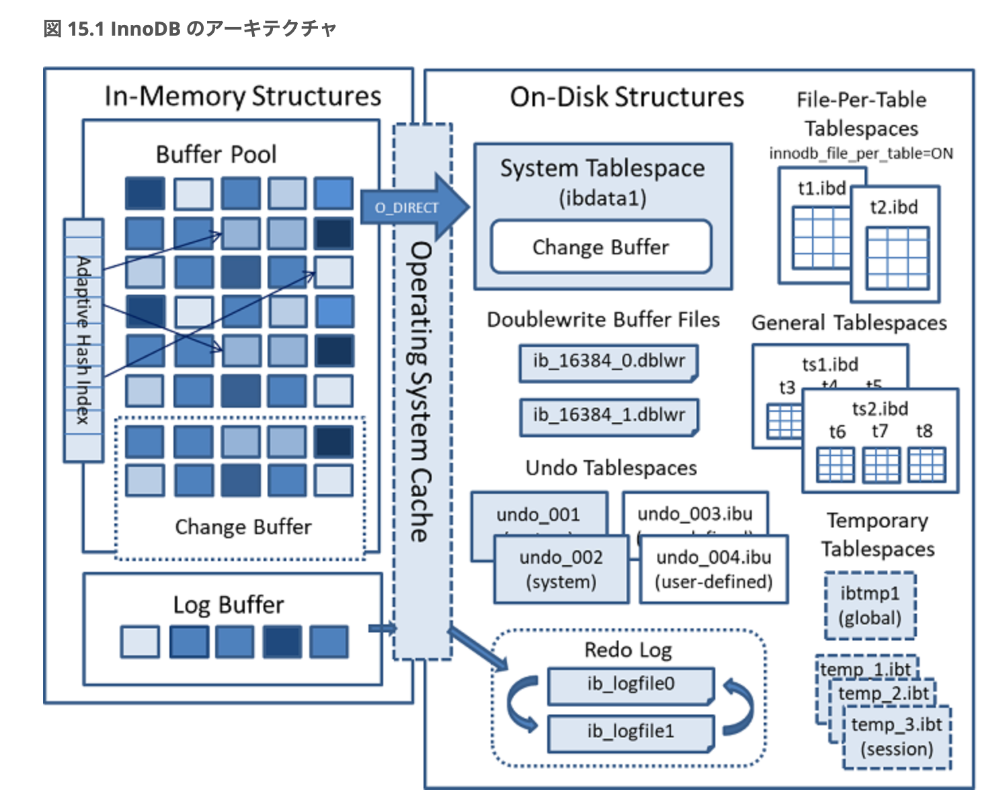
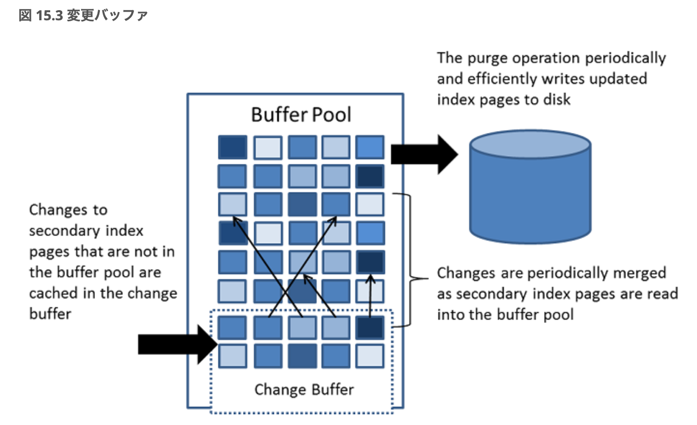

# MySQLのストレージエンジンについて

## 0. はじめに
- 検証用環境は[検証用のDBコンテナを作成する](https://zenn.dev/t_kuroiwa/articles/041da5abee95b9)を参照
  - MySQLのバージョンは`8.4.0`を使用

## 1. MySQLのストレージエンジンについて
### そもそもストレージエンジンとは？
- テーブルにデータを追加したり、変更したり、削除したり、検索したり・・・
  - **データベースに対して行う具体的な動作は、ストレージエンジンというプログラムが担当している**
  - **データの保存・処理のやり方を決める裏方の仕組み**
- ストレージエンジンにはいくつかの種類があり、それぞれ得意なことや特徴が異なる（得意・不得意がある！）
- **テーブル単位でストレージエンジンを選択できる**
- MySQL公式サイトには以下のように記載されている（引用：https://dev.mysql.com/doc/refman/8.0/ja/storage-engines.html）
  - さまざまなテーブル型に対する SQL 操作を処理する MySQL コンポーネント

### ストレージエンジンの種類を見てみる
```sql
mysql> select version();
+-----------+
| version() |
+-----------+
| 8.4.0     |
+-----------+
1 row in set (0.00 sec)
             
mysql> SHOW ENGINES;
+--------------------+---------+----------------------------------------------------------------+--------------+------+------------+
| Engine             | Support | Comment                                                        | Transactions | XA   | Savepoints |
+--------------------+---------+----------------------------------------------------------------+--------------+------+------------+
| ndbcluster         | NO      | Clustered, fault-tolerant tables                               | NULL         | NULL | NULL       |
| MEMORY             | YES     | Hash based, stored in memory, useful for temporary tables      | NO           | NO   | NO         |
| InnoDB             | DEFAULT | Supports transactions, row-level locking, and foreign keys     | YES          | YES  | YES        |
| PERFORMANCE_SCHEMA | YES     | Performance Schema                                             | NO           | NO   | NO         |
| MyISAM             | YES     | MyISAM storage engine                                          | NO           | NO   | NO         |
| FEDERATED          | NO      | Federated MySQL storage engine                                 | NULL         | NULL | NULL       |
| ndbinfo            | NO      | MySQL Cluster system information storage engine                | NULL         | NULL | NULL       |
| MRG_MYISAM         | YES     | Collection of identical MyISAM tables                          | NO           | NO   | NO         |
| BLACKHOLE          | YES     | /dev/null storage engine (anything you write to it disappears) | NO           | NO   | NO         |
| CSV                | YES     | CSV storage engine                                             | NO           | NO   | NO         |
| ARCHIVE            | YES     | Archive storage engine                                         | NO           | NO   | NO         |
+--------------------+---------+----------------------------------------------------------------+--------------+------+------------+
11 rows in set (0.01 sec)
```
- たくさんある（11種類）
  - たくさんあるので、本記事では全部の説明は割愛
  - MySQLの公式ドキュメントが詳しい：https://dev.mysql.com/doc/refman/8.0/ja/storage-engines.html

## 2. InnoDBとは
- MySQL 5.5以降のバージョンにおけるデフォルトのストレージエンジンであるInnoDBについて詳しく見ていく

### InnoDBのアーキテクチャ
- [出典：15.4 InnoDB のアーキテクチャ](https://dev.mysql.com/doc/refman/8.0/ja/innodb-architecture.html)



#### InnoDBのメモリ内構造
- バッファプール(`Buffer Pool`)
  - データとインデックスのキャッシュを格納するメモリ領域
  - バッファプールを使用すると、頻繁に使用されるデータをメモリーから直接処理できるため、処理速度が向上する
  - 専用サーバーでは、多くの場合、最大 80% の物理メモリーがバッファプールに割り当てられる
  - 参照：https://dev.mysql.com/doc/refman/8.0/ja/innodb-buffer-pool.html

- チェンジバッファ(`Change Buffer`)
  - secondary index ページが buffer pool にない場合に、そのページに対する変更をキャッシュする特別なデータ構造
  - チェンジバッファは、データの挿入、更新、削除操作を遅延して実行するために使用される
  - これにより、ディスク I/O を削減し、データの挿入、更新、削除のパフォーマンスを向上させる
  - 参照：https://dev.mysql.com/doc/refman/8.0/ja/innodb-change-buffer.html

- [出典：15.5.2 変更バッファ](https://dev.mysql.com/doc/refman/8.0/ja/innodb-architecture.html)




- ログバッファ(`Log Buffer`)
  - トランザクションのログレコードを一時的に保存するためのメモリ領域 
  - ログバッファサイズは、innodb_log_buffer_size 変数によって定義
  - トランザクションがコミットされると、ログバッファの内容がログファイルに書き込まれる
  - ログバッファの内容は定期的にディスクにフラッシュされる、デフォルトのサイズは 16M バイト

#### InnoDBのストレージ構造
- ！！後ほどかく！！

## 3. まとめ
- MySQLにはいくつかのストレージエンジンがある
- テーブル単位でストレージエンジンを選択できる
- InnoDBはMySQL 5.5以降のバージョンにおけるデフォルトのストレージエンジン

## 参考記事
- [MySQL 8.0 リファレンスマニュアル / 代替ストレージエンジン](https://dev.mysql.com/doc/refman/8.0/ja/storage-engines.html)
- [MySQLのストレージエンジンについて](https://qiita.com/ishishow/items/280a9d049b8f7bcbc14a)

